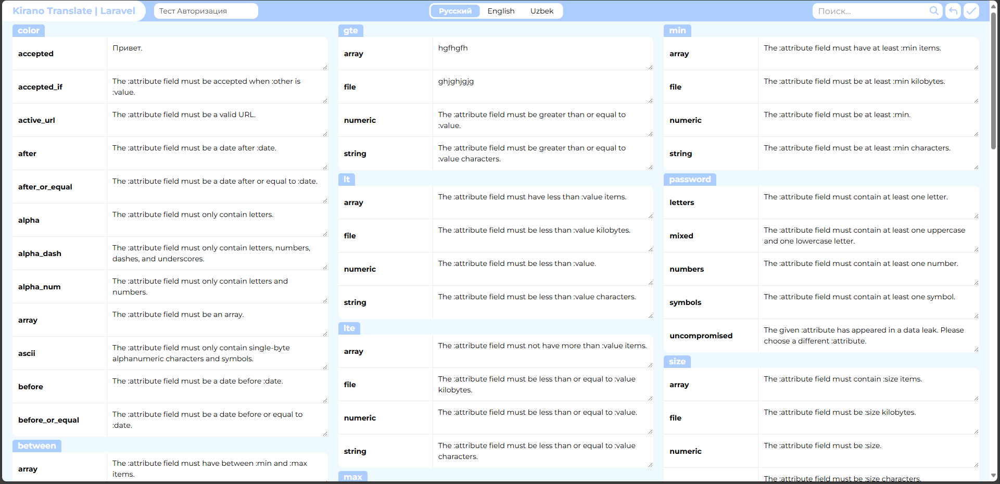

<p align="center"></p>

# Laravel Translation panel

## Getting Started

You can download the package via composer:

```bash
composer require monosniper/laravel-translate
```

Publish config file (kirano_translate.php):

```bash
php artisan vendor:publish --provider="Monosniper\LaravelTranslate\LaravelTranslateServiceProvider"
```
